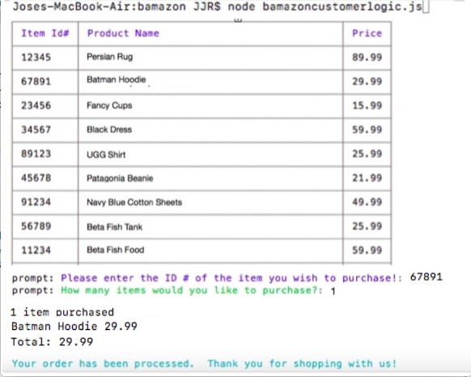

### Synopsis/Overview
***

An interactive shopping node app where MySQL and Node.JS are used to allow users to purchase items as a customer,
Future Development: 
view, track and update the product inventory as a manager, and track the total sales by department as an executive.

##### Bamazon Customer Portal 
***

The Bamazon Customer Portal allows users to view the current items available for purchase.  The user will be prompted to enter the item id# and how many items they wish to purchase.  If the item is in stock, the order will be completed and the user will see the total amount of their purchase.

#### Contributors:
***

Jose Joel Romero [GitHub](https://github.com/JoseJWeb)

#### Technologies Used:
***

* Javascript
* nodeJS
* MySQL
* npm packages:
	- [mysql](https://github.com/felixge/node-mysql)
	- [prompt](https://github.com/flatiron/prompt)
	- [colors/safe](https://github.com/Marak/colors.js)
	- [cli-table](https://github.com/Automattic/cli-table)

#### License
***

Copyright 2017 University of Utah Coding Bootcamp - Jose Joel Romero

